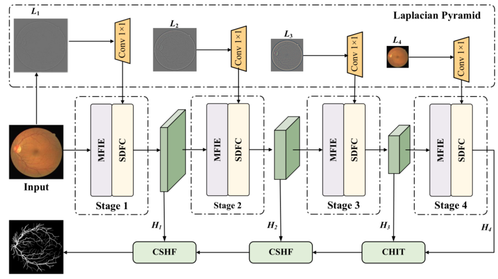

<h1 align="center">Hierarchical Refinement Network with Multi-Frequency Interaction for retinal vessel segmentation. </h1>

## 📌 Overview

Precise retinal vasculature segmentation is critical for diagnosing various ophthalmological diseases, yet inherent challenges persist due to the complex multi-scale intricacy of vascular structure. Existing methods often struggle to balance the representation of high-frequency components and fine-grained details, which are crucial for precise retinal vasculature segmentation. To address this challenge, we propose a Hierarchical Refinement Network with Multi-Frequency Interaction (HR-MFNet), a novel architecture designed to explicitly handle features across different scales. Specifically, the Multi-Frequency Interaction Enhancer (MFIE) employs parallel frequency-specific branches with asymmetric channel shuffle to enhance feature diversity while decoupling structural information from local fine-grained details. Then, the Spatial Detail Feature Calibration (SDFC) module leverages high-frequency residuals from a Laplacian pyramid to anchor delicate vascular boundaries, effectively compensating for spatial detail loss. Finally, the Cross-Scale Hierarchical Fusion (CSHF) module bridges the semantic gap across scales via a dynamic masking mechanism, which leverages high-confidence predictions from deep-level representations to adaptively suppress redundant high-resolution features while maintaining delicate spatial details. Extensive experiments are conducted on multiple public datasets, including DRIVE, Chase\_DB1, OCTA500-6M, OCTA500-3M, and DAC1 datasets. HR-MFNet achieves F1 scores of 82.90\%, 81.50\%, 88.84\%, 91.54\% and 79.07\%,  along with MIoU scores of 70.85\%, 68.77\%, 79.91\%, 84.63\% and 65.73\%. These results outperform those of 11 competing networks for retinal vasculature segmentation.

<div align="center">

<br>
Ilustration of the proposed framework. 
</div>


This repository includes training and inference code for HR-MFNet.

- Entry point: `main.py`
- Training config: `configs/train.yml`
- Inference config: `configs/inference.yml`
- Training script: `bash_train.sh`
- Inference script: `bash_inference.sh`

## Todo
- [x] ~~Release  Example Code and Checkpoint~~ 


## Environment

- Linux (Ubuntu 22.04+)
- Python 3.9+
- CUDA 12.8 + PyTorch 2.5.0


## Dataset Layout

```text
data/
  DATASET_NAME/
    train/
      input/
      label/
      fov/
    val/
      input/
      label/
      fov/
```

Example:

```text
data/DRIVE/train/input
data/DRIVE/train/label
data/DRIVE/train/fov
data/DRIVE/val/input
data/DRIVE/val/label
data/DRIVE/val/fov
```

Notes:

- Filenames in `input` and `label` must match one-to-one.
- If `use_fov: false`, `fov` is optional.

Supported `dataset_name` values:

- `DRIVE`
- `CHASE_DB1`
- `OCTA500_3MM`
- `OCTA500_6MM`
- `DAC1`

When set to `auto`, these fields are resolved from `dataset_name`:

- `train_x_path / train_y_path / train_z_path`
- `val_x_path / val_y_path / val_z_path`
- `input_size`
- `transform_rand_crop`

## Quick Start

### Train

1. Update `configs/train.yml` (at least: `mode`, `dataset_name`, `data_root`, `model_name`, `CUDA_VISIBLE_DEVICES`).
2. Run:

```bash
bash bash_train.sh
```


Checkpoints are saved to `model_ckpt/<timestamp>/`.

### Inference

1. Update `configs/inference.yml` (at least: `mode`, `dataset_name`, `data_root`, `model_name`, `model_path`, `CUDA_VISIBLE_DEVICES`).
2. Run:

```bash
bash bash_inference.sh
```

```bash

```

Outputs are saved to:

```text
<directory of model_path>/<model filename w9